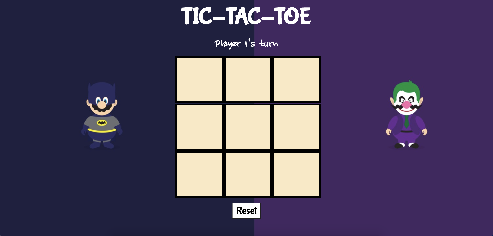

# Tic-Tac-Toe
A simple tic-tac-toe game that allows two users to take turns. The reset button clears the board and initiates a new game.

**View project in browser:** https://dfdev-tictactoe.netlify.app

## Design and Development
**Skills Used** HTML, CSS, JavaScript(OOP):
I built this game by breaking down its components and pseudo-coding what they would do (i.e., taking turns, resetting board, alerting the winner). Doing so made it easier to translate into functions in JavaScript.

## Lessons Learned
After making this game functional, I built this with object-oriented programming.  
